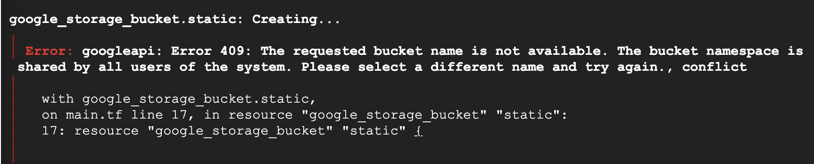

# Create a storage bucket

In the Google Cloud Platform, we have multiple ways to create a storage bucket. Today we will learn how to create one with Terraform.

You need to have a google cloud account to use the platform.&#x20;

## Activate Cloud Shell

In the Google Cloud Console, activate Cloud Shell by clicking the button located in the upper-right corner.

<figure><figcaption><p>Activate cloud shell</p></figcaption></figure>

1. Create a new folder named 'terraform'

```bash
mkdir terraform   # make a directory
```

2. Enter the 'terraform' directory and create a new file called 'main.tf'

```bash
cd terraform  # enter the directory
touch main.tf # create a file
```

3. Launch the Cloud Shell Editor by clicking **Open Editor** on the toolbar of the Cloud Shell window and then open the 'main.tf' file.

<figure><figcaption><p>Check the file structure in Open Editor</p></figcaption></figure>

## Create a storage bucket

1. Write some code into the 'main.tf' and create a new storage bucket in the US multiple region.

```hcl
terraform {
  required_providers {
    google = {
      source = "hashicorp/google"
      version = "3.5.0"
    }
  }
}

provider "google" {

  project = "PROJECT ID"  #replace to your project id
  region  = "REGION"      #replae to your region
  zone    = "ZONE"        #replace to your zone
}

resource "google_storage_bucket" "static" {
 name          = "BUCKET_NAME"  # give your unique bucket name
 location      = "US"
 storage_class = "STANDARD"

}

```

2. Save the file and go back to the terminal.
3. Initialize the  Terraform configuration

```bash
terraform init
```

4. Review the change

```bash
terraform plan
```

<figure><figcaption><p>Check the plan</p></figcaption></figure>

In this plan, a bucket will be created and the bucket name is 'my\_first\_bucket'.

5. Apply the change

```bash
terraform apply
```

Notice,the bucket name must be unique, otherwise you will get error after applying it. So, I change the bucket name to 'my\_first\_unique\_bucket'.

<figure><figcaption><p>Error Notification</p></figcaption></figure>

<figure><figcaption></figcaption></figure>

To review the outcome, navigate to the **Cloud Storage > Buckets** dashboard to locate the newly created storage.

<figure><figcaption><p>Check the storage bucket in dashboard</p></figcaption></figure>


## Key Points

```hcl
terraform {
  required_providers {
    google = {
      source = "hashicorp/google"
      version = "3.5.0"
    }
  }
}
```

#### 1. Terraform block

The `terraform {}` block is required so Terraform knows which provider to download from the [Terraform Registry](https://registry.terraform.io/). In the configuration above, the `google` provider's source is defined as `hashicorp/google` which is shorthand for `registry.terraform.io/hashicorp/google`.

#### 2. Providers

The `provider` block is used to configure the named provider, in this case `google`. A provider is responsible for creating and managing resources. Multiple provider blocks can exist if a Terraform configuration manages resources from different providers.
